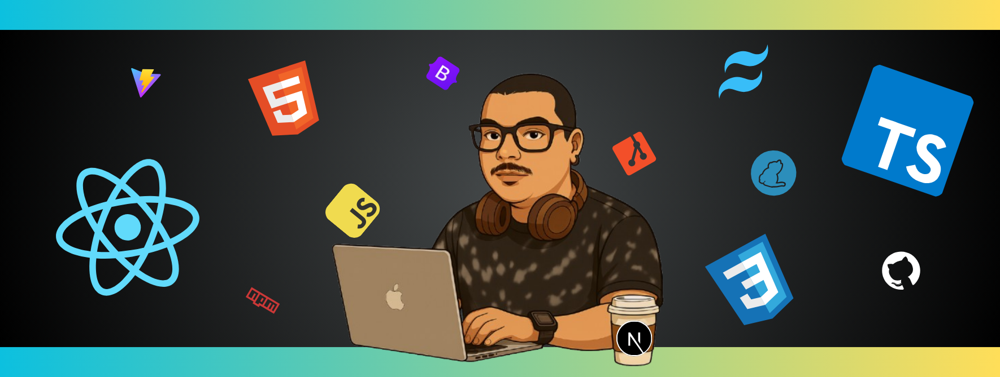

  

<h1 align="center">Hello 👋, I'm Tiago!😁</h1>
<ul>
  <li>💻 Front-End Developer with hands-on experience in React.js and TypeScript;</li>
  <li>🎓 Constantly improving academically and technically, currently pursuing a degree in Systems Analysis and Development;</li>
  <li>🤝 Collaborative, curious, and committed to continuous growth, with a strong interest in problem-solving and creating effective solutions within agile teams;</li>
  <li>🔥 Interest in technology began in the early 2000s, inspired by immersion in MMORPGs and the desire to understand how complex systems work;</li>
</ul>

  <markdown-accessiblity-table data-catalyst>
    <table>
       <thead>
         <tr>
           <th>
             
           </th>
           <th>
             
           </th>
         </tr>
       </thead>
    </table>
  </markdown-accessiblity-table>
<table align="center">
  <tr>
    <td>
      
    </td>
  </tr>
</table>

# 💻 Tech Stack:
 
 
 
 
 
 
 
 
 
 
 
 
 
 
 
 
 
 
 
 
 
 
 

## 🌐 Socials:
  

