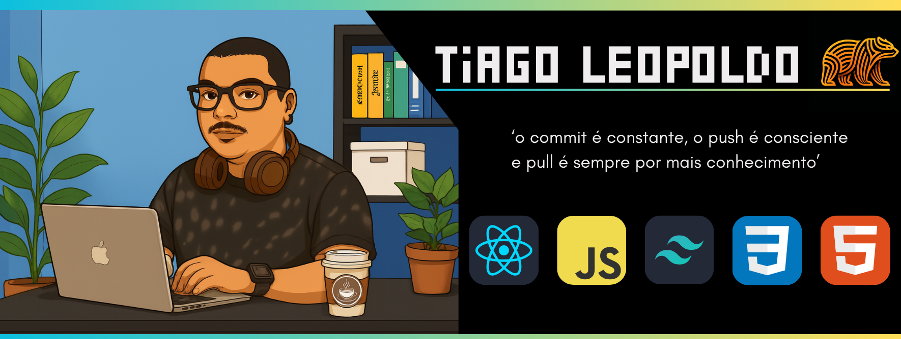

  

<h1 align="center">Olá 👋, eu sou o Tiago!😁</h1>
<ul>
	<li>💻 Desenvolvedor Front-End, com foco em React.js;</li>
	<li>🎓 Atualmente focado em me aprimorar como Dev Front-end;</li>
	<li>🤝 Colaborativo, curioso e sempre em busca de evolução técnica e pessoal;</li>
	<li>🔥 Minha paixão por tecnologia nasceu da curiosidade e da vontade de fazer acontecer, mesmo quando tudo parecia fora do meu alcance;</li>
</ul>

  <markdown-accessiblity-table data-catalyst>
    <table>
       <thead>
         <tr>
           <th>
             
           </th>
           <th>
             
           </th>
         </tr>
       </thead>
    </table>
  </markdown-accessiblity-table>
    <markdown-accessiblity-table data-catalyst>
    <table align="center">
       <thead>
         <tr>
			<th>
             
           </th>
         </tr>
       </thead>
    </table>
  </markdown-accessiblity-table>

## &nbsp;Minha Stack

  

## &nbsp;Repositórios fixados

<table>
	<thead>
		<tr>
			<th colspan="2" width="2000">&nbsp;</th>
		</tr>
	</thead>
	<tbody>
		<tr>
			<td align="center" valign="top" width="80"> 
			
      </td>
			<td valign="top">
			<h3>Javascript Playground</h3>
			
Roteiro de estudos Javascript.

			
			</td>
		</tr></tbody></table>

## &nbsp;Contato

